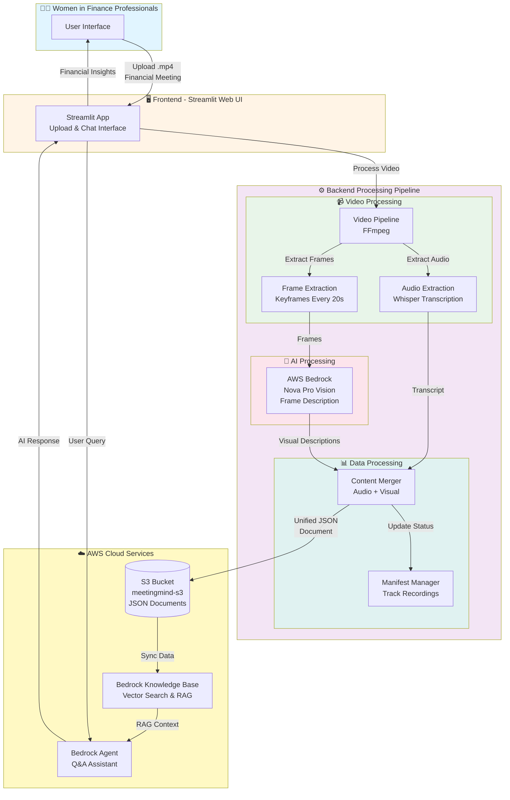

# MeetingMind Financial AI - Architecture Diagram

## System Architecture Flow

## Key Components

### 1. **Frontend (Streamlit Web UI)**
- 📤 Video upload interface
- 💬 Chat interface for Q&A
- 📈 Financial meeting records sidebar
- 👩‍💼 Professional women-focused design

### 2. **Backend Processing Pipeline**

#### Video Processing
- **FFmpeg**: Extract audio and video frames
- **Whisper (tiny model)**: Fast audio transcription
- **Frame Extraction**: Keyframes every 20 seconds
- **Deduplication**: Remove similar frames using perceptual hashing

#### AI Processing
- **AWS Bedrock Nova Pro**: Vision AI for describing financial charts, presentations, and visual content

#### Data Processing
- **Content Merger**: Combines audio transcripts with visual descriptions
- **Manifest Manager**: Tracks processed recordings and metadata

### 3. **AWS Cloud Services**

#### S3 Storage
- Stores unified JSON documents
- Contains merged audio + visual content
- Bucket: `meetingmind-s3`

#### Bedrock Knowledge Base
- Vector search and indexing
- RAG (Retrieval Augmented Generation)
- Enables semantic search across meetings

#### Bedrock Agent
- Conversational AI assistant
- Answers questions about financial meetings
- Provides insights and summaries

## Data Flow

1. **Upload**: User uploads .mp4 financial meeting recording
2. **Process**: Backend extracts audio (Whisper) and frames (FFmpeg)
3. **Analyze**: AWS Bedrock Nova Pro describes visual content
4. **Merge**: Combine audio transcript + visual descriptions
5. **Store**: Upload unified JSON to S3
6. **Index**: Sync with Bedrock Knowledge Base
7. **Query**: User asks questions via chat interface
8. **Respond**: Bedrock Agent retrieves context and generates answers

## Technology Stack

- **Frontend**: Streamlit (Python)
- **Backend**: Python 3.11+
- **Video Processing**: FFmpeg, OpenCV
- **Audio Transcription**: OpenAI Whisper
- **AI/ML**: AWS Bedrock (Nova Pro, Knowledge Base, Agent)
- **Storage**: AWS S3
- **Region**: us-west-2

## Use Cases

- 📈 Quarterly Earnings Call Analysis
- 🏦 Board Meeting Summaries
- 💰 Investor Presentation Insights
- 📊 Financial Planning Review
- 🎯 Budget & Strategy Meeting Q&A

---

**Built for**: Women in Financial AI - AWS Cloud Women Agentic AI Hackathon 🏆
