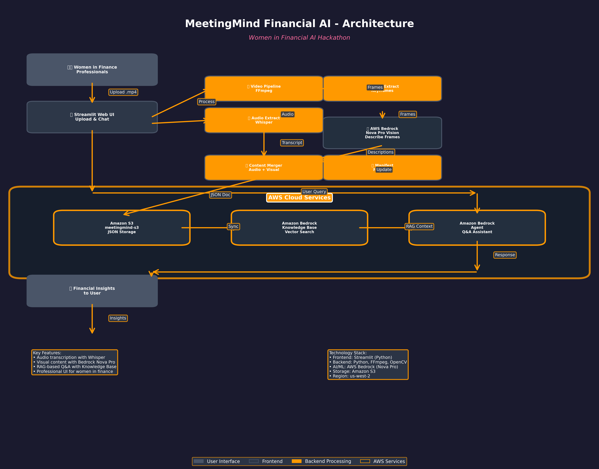

# 💼 MeetingMind Financial AI

> **AI-Powered Meeting Intelligence for Women in Finance**  
> Built for the Women in Financial AI - AWS Cloud Women Agentic AI Hackathon

MeetingMind is an intelligent meeting assistant that extracts both audio transcripts and visual content from financial meeting recordings, enabling natural language Q&A through AWS Bedrock's RAG architecture.

[](https://aws.amazon.com/bedrock/)
[](https://www.python.org/)
[](https://streamlit.io/)

## 🎯 Overview

MeetingMind automatically processes meeting recordings (.mp4) to create a searchable knowledge base that captures:
- 🎤 **Spoken Content**: Audio transcription using Whisper
- 📊 **Visual Content**: Screen captures described by AWS Bedrock Nova Pro Vision
- 💬 **Intelligent Q&A**: RAG-based chat powered by Bedrock Agent and Knowledge Base

Perfect for financial professionals who need to quickly reference key metrics, charts, and discussions from past meetings.

## 🏗️ Architecture



### Data Flow

1. **Upload**: Users upload .mp4 meeting recordings via Streamlit web interface
2. **Processing Pipeline**:
   - Video split into audio and visual streams (FFmpeg)
   - Audio transcribed using Whisper (tiny model for speed)
   - Keyframes extracted every 20 seconds
   - Visual content described using AWS Bedrock Nova Pro Vision
   - Transcript and descriptions merged into structured JSON
3. **Storage & Indexing**:
   - JSON documents uploaded to Amazon S3
   - Automatically synced to Bedrock Knowledge Base for vector search
4. **Query & Response**:
   - Users ask questions via chat interface
   - Bedrock Agent retrieves relevant context from Knowledge Base
   - AI-generated responses with source citations

## ✨ Features

- **🚀 Automated Processing**: Upload videos and let the system handle the rest
- **🎵 Audio Transcription**: Extracts and transcribes audio using Whisper
- **👁️ Visual Intelligence**: Describes charts, dashboards, and screen content using AWS Bedrock Nova Pro
- **🔍 Smart Search**: RAG-based retrieval finds relevant information from both audio and visual content
- **💬 Natural Language Q&A**: Ask questions in plain English about your meetings
- **📝 Source Citations**: Answers include meeting names, dates, and timestamps
- **🎨 Professional UI**: Streamlit web interface designed for financial professionals
- **☁️ Cloud-Native**: Built on AWS services for scalability and reliability

## 🛠️ Technology Stack

- **Frontend**: Streamlit (Python)
- **Backend**: Python, FFmpeg, OpenCV
- **AI/ML**: AWS Bedrock (Nova Pro Vision)
- **Transcription**: OpenAI Whisper
- **Storage**: Amazon S3
- **Vector Database**: Bedrock Knowledge Base (OpenSearch Serverless)
- **Agent Framework**: Bedrock Agent with RAG
- **Region**: us-west-2

## 📋 Prerequisites

1. **Python 3.11+**
   ```bash
   python3 --version
   ```

2. **ffmpeg** (for audio/video processing)
   ```bash
   # macOS
   brew install ffmpeg
   
   # Ubuntu/Debian
   sudo apt-get install ffmpeg
   
   # Verify installation
   ffmpeg -version
   ```

3. **AWS Account** with access to:
   - Amazon Bedrock (Nova Pro, Llama 3.3 70B)
   - Amazon S3
   - Bedrock Knowledge Base
   - Bedrock Agent
   
4. **AWS Credentials** configured with appropriate permissions

## 🚀 Quick Start

### 1. Clone and Install

```bash
git clone <your-repo-url>
cd MeetingMind
pip install -r requirements.txt
```

### 2. Configure AWS Services

#### A. Create S3 Bucket
```bash
aws s3 mb s3://meetingmind-s3 --region us-west-2
```

#### B. Create Bedrock Knowledge Base
1. Go to AWS Console → Bedrock → Knowledge Bases
2. Click "Create knowledge base"
3. **Name**: `MeetingMind-KB`
4. **Data source**: S3 bucket created above
5. **Embedding model**: Titan Embeddings G1 - Text
6. **Vector store**: Create new OpenSearch Serverless collection
7. **Note the Knowledge Base ID and Data Source ID**

#### C. Create Bedrock Agent
1. Go to AWS Console → Bedrock → Agents
2. Click "Create agent"
3. **Name**: `MeetingMind-Agent`
4. **Model**: Llama 3.3 70B Instruct
5. **Instructions**: 
   ```
   You are MeetingMind, an AI assistant that answers questions about financial 
   meeting recordings. Your knowledge comes from both spoken content (what was 
   said) and visual content (what was shown on screen like charts, dashboards, 
   and presentations). Always cite the meeting name, date, and timestamp when 
   answering. Focus on financial metrics, projections, and key business insights.
   ```
6. **Add Knowledge Base**: Select the KB created above
7. **Note the Agent ID**

### 3. Configure Environment

Create a `.env` file in the `MeetingMind/` directory:

```bash
# AWS Configuration
AWS_REGION=us-west-2
AWS_ACCESS_KEY_ID=your_access_key_here
AWS_SECRET_ACCESS_KEY=your_secret_key_here
AWS_SESSION_TOKEN=your_session_token_here  # Optional, for temporary credentials

# AWS Resource IDs
S3_BUCKET_NAME=meetingmind-s3
BEDROCK_KB_ID=your_knowledge_base_id_here
BEDROCK_DATA_SOURCE_ID=your_data_source_id_here
BEDROCK_AGENT_ID=your_agent_id_here
BEDROCK_AGENT_ALIAS_ID=TSTALIASID

# Model Configuration
VISION_MODEL_ID=us.amazon.nova-pro-v1:0
WHISPER_MODEL_SIZE=tiny

# Processing Configuration
SCREENSHARE_ENABLED=false
FRAME_INTERVAL=20
```

### 4. Run the Application

#### Option A: Web Interface (Recommended)

```bash
cd frontend
streamlit run app.py
```

Then open your browser to `http://localhost:8501`

#### Option B: CLI Tools

**Terminal 1 - Start Ingestion Service:**
```bash
python3 ingest.py
```

**Terminal 2 - Chat Interface:**
```bash
python3 chat.py
```

### 5. Upload and Process Meetings

1. Upload a .mp4 meeting recording via the web interface
2. Click "Analyze Meeting" to start processing
3. Wait for processing to complete (status updates automatically)
4. Select the processed meeting from the sidebar
5. Ask questions in the chat interface!

## 💡 Usage Examples

### Example Questions

- "What were the Q4 revenue projections discussed?"
- "Show me the key metrics from the dashboard"
- "What action items were mentioned in the meeting?"
- "Summarize the financial performance charts shown"
- "What were the main concerns raised about the budget?"

### Sample Workflow

1. **Upload**: Drop your quarterly review meeting recording
2. **Process**: System extracts audio transcript + describes all charts/slides
3. **Query**: "What was our customer acquisition cost trend?"
4. **Response**: AI answers with specific numbers and timestamps from both spoken content and visual charts


## 📁 Project Structure

```
MeetingMind/
├── backend/                    # Core processing modules
│   ├── audio_pipeline.py      # Audio extraction and transcription
│   ├── video_pipeline.py      # Video frame extraction
│   ├── vision_describer.py    # AWS Bedrock Nova Pro integration
│   ├── merger.py              # Combine audio + visual content
│   ├── s3_uploader.py         # Upload to S3
│   ├── kb_sync.py             # Sync with Bedrock Knowledge Base
│   ├── chat.py                # Bedrock Agent chat interface
│   └── ...
├── frontend/                   # Streamlit web interface
│   ├── app.py                 # Main application
│   ├── components/            # UI components
│   │   ├── sidebar.py         # Meeting list sidebar
│   │   ├── chat_interface.py  # Chat UI
│   │   └── upload.py          # Upload component
│   └── api/                   # Backend API wrappers
├── data/                       # Local data storage
│   ├── audio/                 # Extracted audio files
│   ├── frames/                # Extracted video frames
│   ├── transcripts/           # Whisper transcripts
│   └── manifest.json          # Processing status tracking
├── recordings/                 # Drop .mp4 files here
├── ingest.py                  # CLI ingestion service
├── chat.py                    # CLI chat interface
├── requirements.txt           # Python dependencies
└── .env                       # Configuration (not in git)
```

## 🔧 Configuration Options

### Environment Variables

| Variable | Description | Default |
|----------|-------------|---------|
| `AWS_REGION` | AWS region for services | `us-west-2` |
| `S3_BUCKET_NAME` | S3 bucket for JSON storage | Required |
| `BEDROCK_KB_ID` | Knowledge Base ID | Required |
| `BEDROCK_DATA_SOURCE_ID` | Data Source ID | Required |
| `BEDROCK_AGENT_ID` | Agent ID | Required |
| `VISION_MODEL_ID` | Vision model for frame description | `us.amazon.nova-pro-v1:0` |
| `WHISPER_MODEL_SIZE` | Whisper model size | `tiny` |
| `FRAME_INTERVAL` | Seconds between frame extraction | `20` |
| `SCREENSHARE_ENABLED` | Enable screen-share detection | `false` |

### Whisper Model Options

- `tiny`: Fastest, good for quick processing (recommended)
- `base`: Better accuracy, slower
- `small`: Even better accuracy, much slower
- `medium`: High accuracy, very slow
- `large`: Best accuracy, extremely slow

## 🎨 UI Features

- **📈 Financial Meeting Records**: Sidebar showing all processed meetings
- **💬 Financial Insights Chat**: Main chat interface with scrollable history
- **📤 Upload Financial Meeting**: Drag-and-drop video upload with progress tracking
- **👩‍💼 Professional Design**: Tailored for women in finance with appropriate branding
- **🔄 Real-time Status**: Automatic status updates during processing
- **🎯 Meeting Selection**: Click any meeting to load its context for Q&A

## 🚨 Troubleshooting

### Common Issues

**1. AWS Credentials Expired**
```bash
# Update your .env file with fresh credentials
AWS_ACCESS_KEY_ID=new_key
AWS_SECRET_ACCESS_KEY=new_secret
AWS_SESSION_TOKEN=new_token
```

**2. Processing Stuck at "In Progress"**
- Check AWS Console → Bedrock → Knowledge Base → Data Source sync status
- Manually trigger sync if needed
- Use "Refresh Status" button in UI

**3. No Audio in Video**
- System handles this gracefully - will process visual content only
- Check logs for "No audio stream found" message

**4. Vision Model Access Denied**
- Ensure Nova Pro model is enabled in your AWS account
- Go to AWS Console → Bedrock → Model access
- Request access to `us.amazon.nova-pro-v1:0`

**5. Knowledge Base Sync Conflicts**
- System handles ConflictException gracefully
- Files still uploaded to S3 even if sync fails
- Can manually sync from AWS Console

## 🔐 Security Best Practices

- Never commit `.env` file to git (already in `.gitignore`)
- Use IAM roles with least privilege access
- Rotate AWS credentials regularly
- Use temporary credentials when possible
- Enable S3 bucket encryption
- Review Bedrock Agent permissions

## 📊 Performance Tips

1. **Use `tiny` Whisper model** for faster processing (good enough for most cases)
2. **Disable screen-share detection** if not needed (`SCREENSHARE_ENABLED=false`)
3. **Increase frame interval** for longer meetings (`FRAME_INTERVAL=30`)
4. **Process videos in batches** during off-hours
5. **Monitor AWS costs** - Bedrock API calls can add up

## 🤝 Contributing

This project was built for the Women in Financial AI Hackathon. Contributions are welcome!

1. Fork the repository
2. Create a feature branch (`git checkout -b feature/amazing-feature`)
3. Commit your changes (`git commit -m 'Add amazing feature'`)
4. Push to the branch (`git push origin feature/amazing-feature`)
5. Open a Pull Request

## 📄 License

This project is licensed under the MIT License - see the LICENSE file for details.

## 🏆 Hackathon

Built for **Women in Financial AI - AWS Cloud Women Agentic AI Hackathon**

**Team**: Women Leading Finance  
**Focus**: Empowering women in finance with AI-powered meeting intelligence

## 🙏 Acknowledgments

- AWS Bedrock team for the amazing AI services
- OpenAI for Whisper transcription
- Streamlit for the beautiful UI framework
- All the women in finance who inspired this project

## 📞 Support

For questions or issues:
- Open an issue on GitHub
- Check the troubleshooting section above
- Review AWS Bedrock documentation

---

**💡 Built by Women, For Women in Finance | Powered by AWS Bedrock & Agentic AI**
